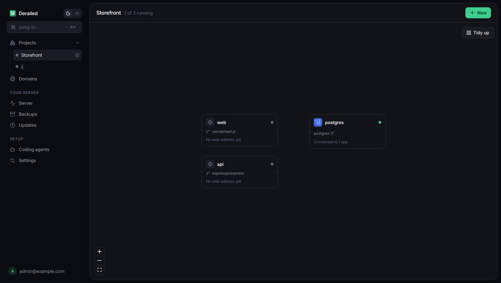
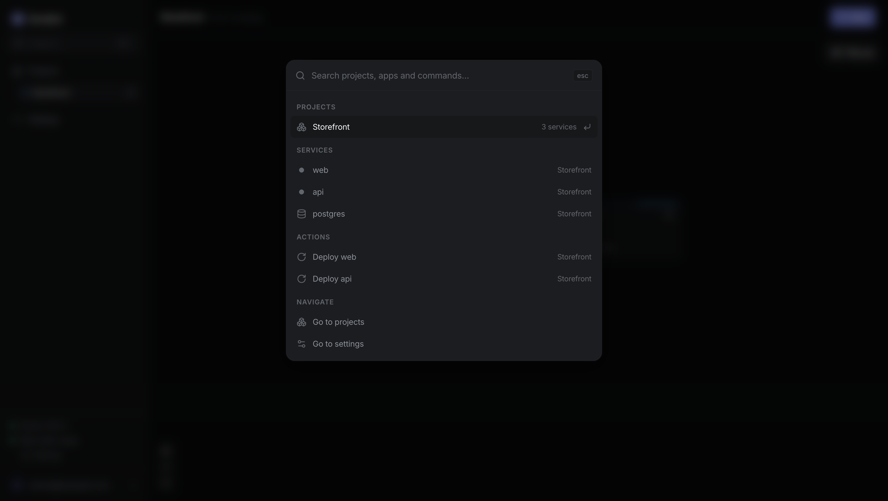
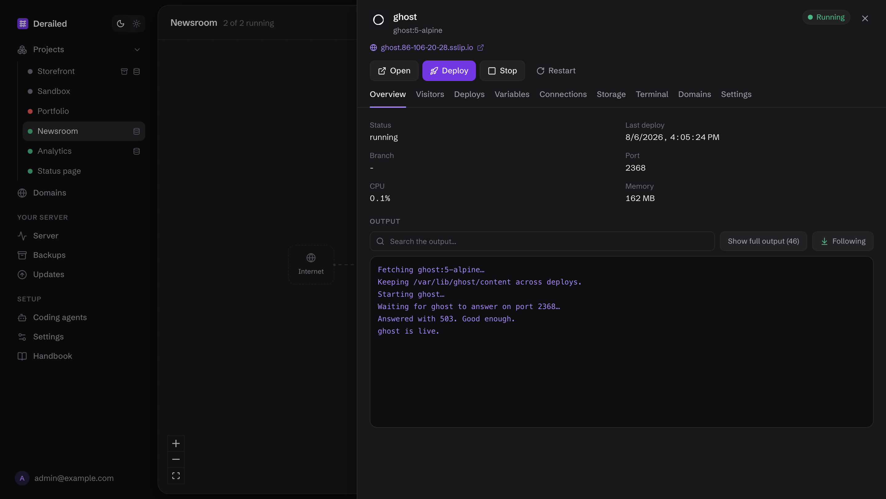
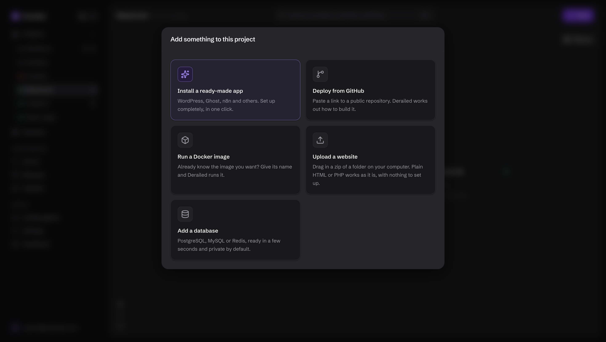
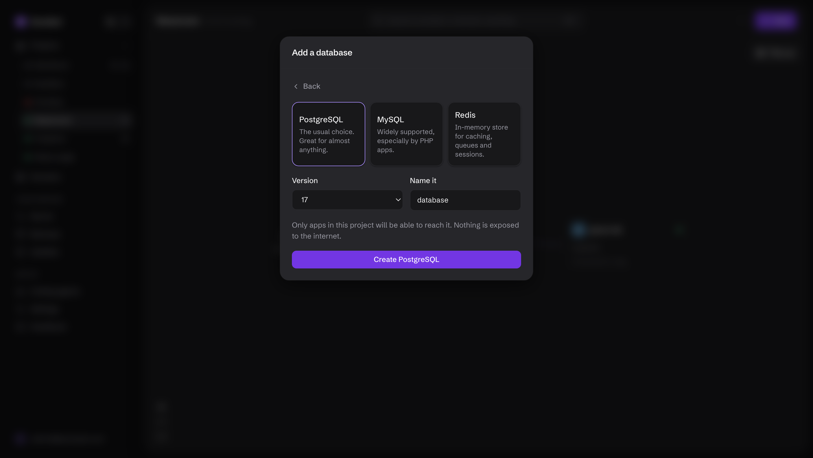
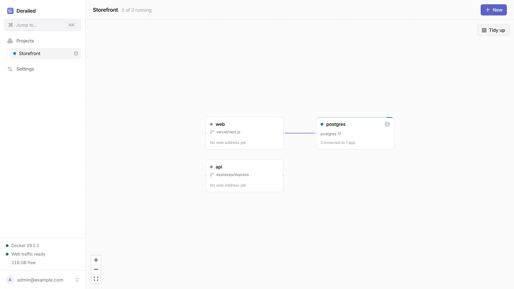

<div align="center">


# Derailed

### Your own tiny cloud.

**One binary on your server. Paste a GitHub link, get a running app with HTTPS.**

No YAML. No `docker-compose` to babysit. No Kubernetes. No monthly bill.

[](LICENSE)
[](https://bun.sh)
[](docs/install.md)
[](docs/contributing.md)

<br>



</div>

<br>

## Install it

On a fresh Linux server, as root:

```sh
curl -fsSL https://raw.githubusercontent.com/emilishostinger/derailed/main/install.sh | sh
```

That is the whole setup. It installs Docker if it is missing, drops a single binary at
`/usr/local/bin/derailed`, sets it up as a service, and prints a URL. Open the URL, make
an account, paste a repository link.

<sub>Debian, Ubuntu, Fedora, RHEL, Rocky, Alma, Arch, Alpine, openSUSE · 64-bit Intel or ARM ·
nothing else to install · takes about a minute ·
[other ways to install](docs/install.md) · [what it does to your server](docs/security.md)</sub>

<br>

## The problem

You have a $5 VPS and something you want to put on the internet.

Today that means SSH, Docker, a reverse proxy, certificates, DNS, a systemd unit and a
weekend. Then a month later you cannot remember how any of it fits together, and the
certificate has quietly expired.

Derailed makes it five minutes in a browser, and keeps making sense afterwards.

<br>

## What you get

|  |  |
| --- | --- |
| 🚀 **Paste a link, get an app** | Any GitHub repository, public or private. Dockerfile or not: without one, Derailed works out how to build it and says what it found in plain language. |
| 🔄 **Push, and it deploys** | Turn it on and the running app catches up with your branch on its own, within a couple of minutes. No webhook, no public URL, no shared secret. Works with GitLab, Bitbucket and Gitea too. Or wait for a tagged release instead, if pushing and shipping are separate decisions. |
| 📦 **Or just drag in a zip** | A folder of HTML is served as it is. A folder of PHP gets PHP and Apache. No repository, no account, no build step. |
| ⚡ **Twenty apps in one click** | WordPress, Nextcloud, Gitea, Jellyfin, Vaultwarden, Grafana and more, each with its database and storage already right. |
| 🔒 **HTTPS that just happens** | Type your domain, follow the on-screen checklist, get a padlock. Point a wildcard at the server and every app gets a secured name automatically. |
| 🗄️ **Databases in one click** | PostgreSQL, MySQL, MariaDB, MongoDB, Redis and Valkey. Private by default. Connect one to an app and the credentials are wired in for you. |
| 📈 **Visitor figures, no tracker** | Counted by the proxy that already serves every request. No script in your pages, nothing leaves the machine, nothing to consent to. |
| 💾 **Backups you can restore** | Scheduled per project, and an ordinary `.tar.gz` you can download and open with `tar`. Restoring stops the app first, because emptying a folder underneath a running app is how people lose data. |
| 🤖 **Runs from your editor** | An MCP server, so Claude Code, Cursor or Codex can deploy, read logs and add domains in the same conversation where you write the code. |
| 🗺️ **A map, not a wall of panels** | The project view *is* the topology: what is running, what talks to what, what is on fire. |
| 💬 **Plain language everywhere** | Never "ingress", never "SIGTERM". When something breaks, the error says what to do next. |

<br>

## See it

|  |  |
| --- | --- |
|  |  |
| `⌘K` finds projects, apps, actions and the handbook | Logs, deploys, variables and domains in one place |
|  |  |
| A ready-made app, a GitHub link, an image or a zip | Databases in one click, private by default |

There is a light theme too:



<br>

## Why not just use…

**A PaaS?** Because it is your server, your data, and $5 instead of $25 a month once you
have more than one thing running.

**Plain Docker and a reverse proxy?** That is exactly what this is, with the parts that
are tedious to get right (certificates, health-checked deploys, backups that restore,
storage that survives) done once, properly, and explained.

**Coolify or Dokploy?** Both are further along in features. Derailed aims somewhere
else: at someone who has never opened a terminal. One binary with nothing to install
alongside it, every screen in plain English, and the dangerous actions explaining
themselves before you take them rather than after.

<br>

## How it works

```
  systemd ──▶ derailed          one binary: API + dashboard + build pipeline
              ├── SQLite        /var/lib/derailed/derailed.db
              ├── Docker        unix:/var/run/docker.sock
              └── Caddy admin   127.0.0.1:2019

  Docker
   ├── caddy                    ports 80/443, certificates, access log
   ├── your apps                built from your repositories
   └── your databases           private to their project
```

A deploy is: fetch → work out the build → build an image → start a container → wait for
it to answer → point the proxy at it → retire the old one. The new container is only
routed once it responds, so a failed deploy is invisible to visitors and the old
version keeps serving.

Derailed only ever touches what it created. Everything it makes is labelled, and
anything unlabelled is left alone, so a machine already running other containers is
safe.

<br>

## Documentation

[**Start here**](docs/README.md). The pages people reach for most:

[Quick start](docs/quickstart.md) ·
[Installing](docs/install.md) ·
[Deploying](docs/deploying.md) ·
[Domains and HTTPS](docs/domains.md) ·
[Databases](docs/databases.md) ·
[Storage](docs/storage.md) ·
[Backups](docs/backups.md) ·
[Visitor figures](docs/analytics.md) ·
[Coding agents](docs/mcp.md) ·
[API](docs/api.md) ·
[CLI](docs/cli.md) ·
[Architecture](docs/architecture.md) ·
[Security](docs/security.md)

<br>

## Building it yourself

Requires [Bun](https://bun.sh).

```sh
bun install
bun run dev        # dashboard on :5173, API on :8422
bun test           # unit and integration; Docker tests skip themselves without a socket
bun run build      # one binary for this machine
bun run build --target=linux-x64     # or cross-compile for a server
```

The dashboard is React and Vite, embedded into the binary at build time, so there is
nothing to serve separately.

<br>

## Honest status

Pre-release, and young. It has been built and run against a real server throughout, the
test suite covers the parts that have broken before, and it is doing real work today.
It has not yet been through a thousand other people's edge cases.

Run it for side projects and internal tools first, keep backups, and
[tell me what breaks](../../issues). That is the fastest way to make it better.

Not there yet: deploying on push, `docker-compose` repositories, more than one server.

<br>

## Contributing

Issues and pull requests are welcome, especially bug reports from real servers. The
code is commented with the reasoning behind decisions rather than a description of what
each line does, so start with the module you are changing and read its header comment.
See [contributing](docs/contributing.md).

<br>

## Licence

MIT. See [LICENSE](LICENSE).

---

<div align="center">

**If this saves you a weekend, a ⭐ helps other people find it.**

</div>
